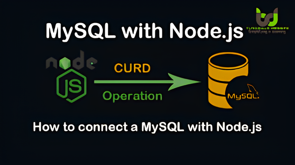

# Node.js x MySQL


<div align="center" style="border-radius: 12px">
  
</div>
<div>
<h2 align="center">Hear the call of the CRUD-lord! 👋</h2>
</div>

## Usage

First step is to initiate a server that requires

```bash
  npm init -y
```

Install required packages (cors is optional but highly suggested)

```bash
  npm i mysql express cors
```

Middleware and imports
```bash
  const express = require("express");
const cors = require("cors");
const mysql = require("mysql");
const app = express()
require('dotenv').config()
const port = process.env.PORT || 5000;

app.use(cors());

app.listen(port, () => {
    console.log(`Server is running on port ${port}`)
  })
```
