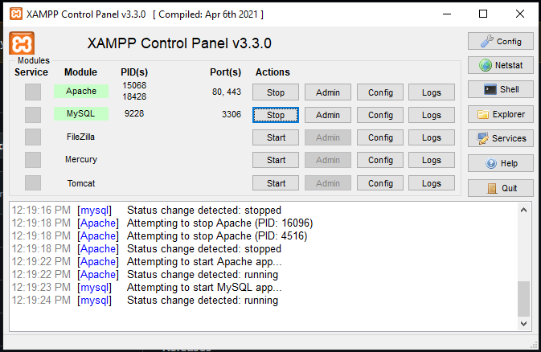

# Node.js x MySQL


<div align="center" style="border-radius: 12px">
  
</div>

<div>
<h2 align="center">Hear the call of the CRUD-lord! 👋</h2>
</div>

## Setup

First step is to initiate a server that requires

```bash
  npm init -y
```

Install required packages (dotenv is optional but highly recommended)

```bash
  npm i mysql express cors dotenv
```

Middleware and imports
```bash
const express = require("express");
const cors = require("cors");
const mysql = require("mysql");
const app = express()
require('dotenv').config()
const port = process.env.PORT || 5000;

app.use(cors());

app.listen(port, () => {
    console.log(`Server is running on port ${port}`)
  })
```
Run XAMP's Apache and MySQl
<div align="center" style="border-radius: 12px">
  
</div>

Configure the mySQL connection
```bash
  mysql.createConnection(
  {
    host:"localhost",
    user:"root",
    password:'',
    database:"krishibid_xamp"
  }
)
```
Create an API , check whether the port is running properly , using nodemon index.js or node index.js from terminal
```bash
app.get('/', (req, res) => {
  res.send('Krishi XAMP Server is Running')
})
```
## API Routes
### Get all News for UI only
#### Backend route - Request: "GET"
```bash
/news
```
#### Table used
```bash
news_api
```
#### Fetch for news UI grid, send req to /news
```bash
const BASE_SQL_URL = import.meta.env.VITE_SQL_SERVER
const NEWS_SQL_API = BASE_API_URL + "/news"
```

### Get Specific News for NewsDetails Page
#### Backend route - Request: "GET"
```bash
/article/:id
```
#### Table used
```bash
news_api, news_article , news_gallery, news_seo 
```
#### Fetch for news UI grid, send req to /news
```bash
const BASE_SQL_URL = import.meta.env.VITE_SQL_SERVER
const NEWS_ARTICLE_API = BASE_API_URL + "/article"
const SpecificNewsAPI = `${NEWS_ARTICLE_API}/${id}`;
```
#### Post a news to backend, send req to /news
```bash
const BASE_SQL_URL = import.meta.env.VITE_SQL_SERVER
const NEWS_SQL_API = BASE_API_URL + "/news"
```

### Get Specific News for NewsDetails Page
#### Backend route - Request: "POST"
```bash
/post/news
```
#### Table used
```bash
news_api, news_article , news_gallery, news_seo 
```
#### Fetch for news UI grid, send req to /news
```bash
const BASE_SQL_URL = import.meta.env.VITE_SQL_SERVER
const SQL_POST_NEWS_API = BASE_API_URL + "/post/news"
```